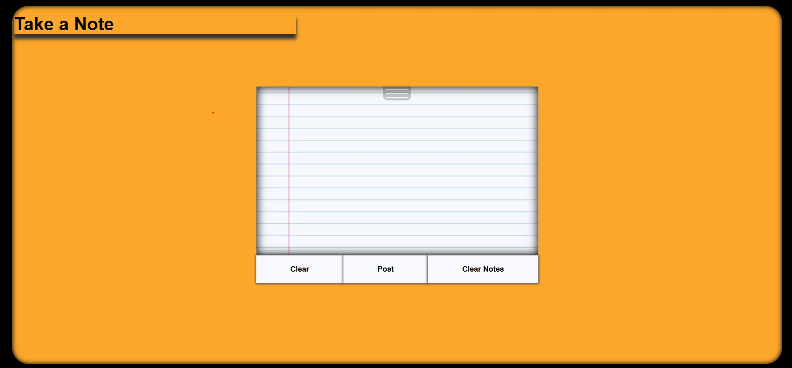

# Case Study: Take a Note


## Description

- The focus of this case study is on a basic note-taking module, _Take a Note_, where security can be improved. Users wants to feel safe knowing their personal data is posted & saved in a secure database. This application will delve into encrypting/decrypting data within the server before __posting__ to the database & __getting__ information from the database respectively.


### Application Setup

_Take a Note_ is a static single-page application (SPA) rendering ```ejs``` from an  ```express``` web server.
<br>
Click here to try the Fastify version


### Issues:
1. #### Database queries are vulnerable to sql-injection attacks.
- Exibit A<br>
<code>
// INSERT (query)<br>
const query = <code style="color:orange;">"insert into notepad(notes,user_id,unix) values('"+note+"','"+req.session.user.id+"','"+dateinfo.unix+"')"</code>
<br>
// execute query<br>
await pool.query(<b style="color:red;">query</b>)</code><br>
The client inserts data into the ```notepad``` table, but there is a problem.The data passed, from the server to the database, is subject to sql-injection attacks.<br>
If an SQL comment string```--```, following malicious commands, was placed into the query without processing, this can more commands add on top of the current INSERT statement.

__Example of Attack__


- Exibit B<br>
<code>// SELECT (query)<br>
const query = <code style="color:orange;">"select notes,timestamp from notepad where user_id='"+req.session.user.id+"';"</code><br>
// execute query<br>
const notes = await pool.query(<b style="color:red;">query</b>)</code><br>
The client has the ability to SELECT, or view, data from the ```notepad``` table. Just like Exibit A, this query seems to be vulnerable to injection attacks.
Attackers will take advantage of the database by viewing it's objects and the data within those objects. 
With prior understanding of SQL jargon, attackers will be able to manipulate the database & action malicious code.

__Example of Attack__


2. #### Database access controls are weak or not properly configured.


3. #### Confidential data is stored in plain-text.