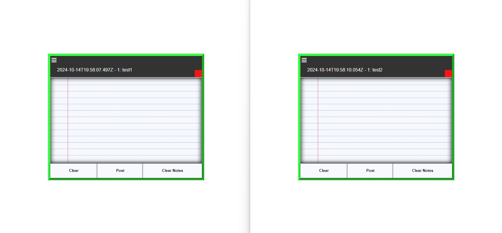
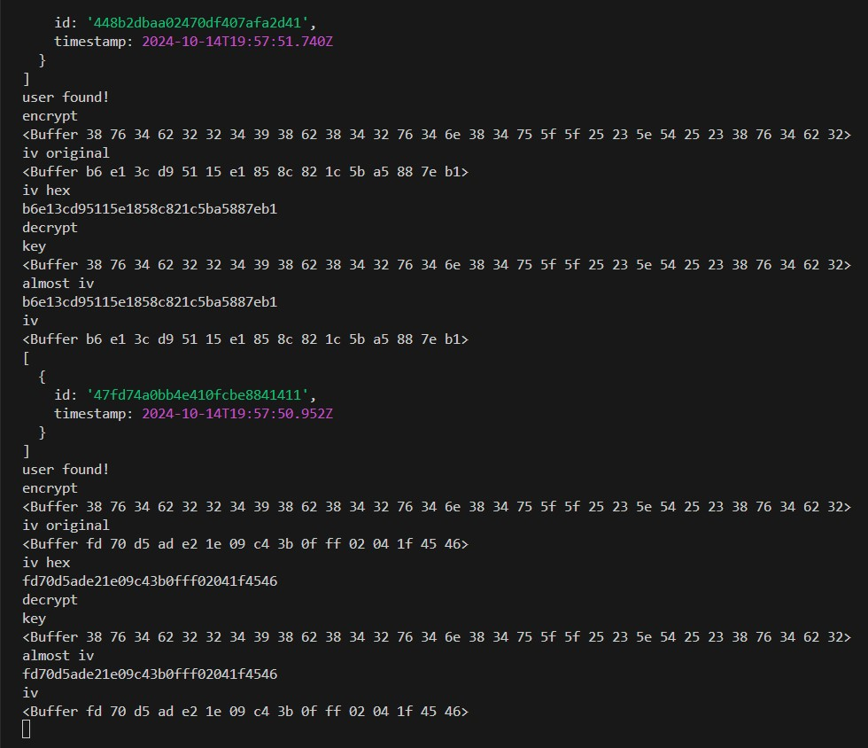
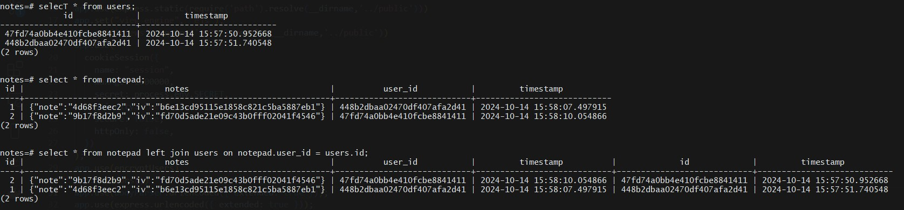

## The Note-taking Module

**Languages**:
1. HTML
2. CSS
3. Javascript

**Framework**:
1. NodeJs
2. Fastify

**Database**:
1. PostgreSql

## About the project

This application enables the user to write notes on a limited & secure session. User login is not required because each session's id is associated with the current date-time the session is create, then hashed before storing into the database.
Sessions expire 30 minutes after the session begins.
upon expiration, database functions **DELETE** rows of the expired user's id within the users table.
In addition, notes are deleted 30 minutes after a note is created.
This project/Application is free for public use.

## Symmetric encryption

<em>Authentication Encryption Standard (AES) 256</em> 
Before storing notes into the database, user input is encrypted in the server. Notes are decrypted in the server after retrieving encrypted notes from the database.

<em>Writing notes to the server & storing into a database for selecting</em>

<em>The Key (buffer) & Initialization Vector (original & hex)</em>

<em>Encrypted json data in database along with stored Initialization vector</em>

